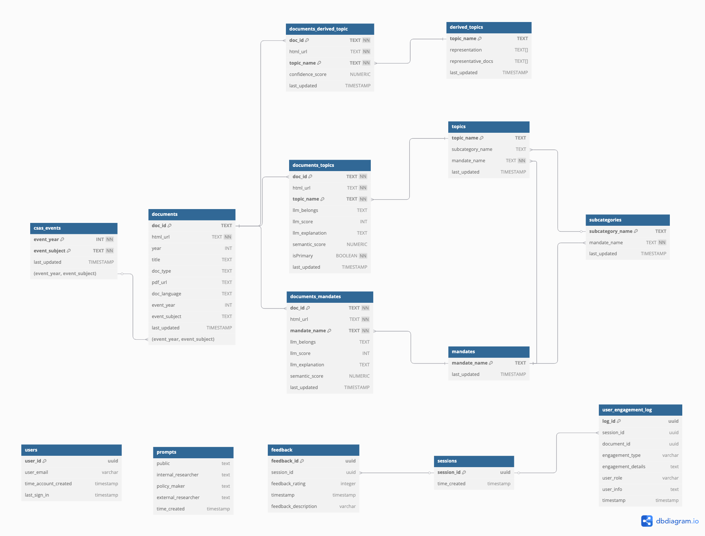

# Architecture Deep Dive

## Table of Contents

- [Architecture Deep Dive](#architecture-deep-dive)
  - [Table of Contents](#table-of-contents)
  - [Architecture](#architecture)
  - [Description](#description)
  - [Database Schema](#database-schema)
    - [Users Table](#users-table)
    - [Prompts Table](#prompts-table)
    - [Sessions Table](#sessions-table)
    - [User Engagement Log Table](#user-engagement-log-table)
    - [Feedback Table](#feedback-table)
    - [CSAS Events Table](#csas-events-table)
    - [Documents Table](#documents-table)
    - [Mandates Table](#mandates-table)
    - [Subcategories Table](#subcategories-table)
    - [Topics Table](#topics-table)
    - [Derived Topics Table](#derived-topics-table)
    - [Documents Derived Topic Table](#documents-derived-topic-table)
    - [Documents Mandates Table](#documents-mandates-table)
    - [Documents Topics Table](#documents-topics-table)
  - [Data Processing Pipeline (Glue Scripts)](#data-processing-pipeline-glue-scripts)
    - [Pipeline Overview](#pipeline-overview)
    - [Data Flow](#data-flow)
    - [Output Structure](#output-structure)
  - [Pipeline Invocation Modes](#pipeline-invocation-modes)
    - [1. HTML Only Mode `html_only`](#1-html-only-mode-html_only)
    - [2. Topic Only Mode `topics_only`](#2-topic-only-mode-topics_only)
    - [3. Full Mode `full_update`](#3-full-mode-full_update)
  - [Script Implementation Details](#script-implementation-details)
    - [1. clean\_and\_ingest\_html.py](#1-clean_and_ingest_htmlpy)
      - [Input](#input)
      - [Processing Logic](#processing-logic)
      - [Output](#output)
      - [Key Functions](#key-functions)
    - [2. ingest\_topics\_and\_mandates.py](#2-ingest_topics_and_mandatespy)
      - [Input](#input-1)
      - [Processing Logic](#processing-logic-1)
      - [Output](#output-1)
    - [3. vector\_llm\_categorization.py](#3-vector_llm_categorizationpy)
      - [Input](#input-2)
      - [Processing Logic](#processing-logic-2)
      - [Output](#output-2)
    - [4. sql\_ingestion.py](#4-sql_ingestionpy)
      - [Input](#input-3)
      - [Processing Logic](#processing-logic-3)
      - [Output](#output-3)
    - [5. topic\_modeling.py](#5-topic_modelingpy)
      - [Input](#input-4)
      - [Processing Logic](#processing-logic-4)
      - [Output](#output-4)

## Architecture


## Description

1.  **Data Ingestion**: Documents are uploaded by an administrator to an **Amazon S3** bucket. This action initiates the data ingestion and processing pipeline.

2.  **Text Extraction and Categorization**: The S3 upload triggers **AWS Glue** workflow. The worflow will orchestrate the Glue jobs to:
      * Scrape, clean and ingest the HTML documents
      * Ingest the topics and mandates
      * Categorize the documents based on the topics and mandates
      * Store the categorized documents in OpenSearch
      * Store the categorized documents in RDS
      * Perform topic modeling on the documents

3.  **Embedding Generation**: The processed and categorized data is sent to **Amazon Bedrock** to generate text embeddings using a foundational model.

4.  **Data Storage and Indexing**: The output from the pipeline is stored in two locations: the relational data is stored in **Amazon RDS**, and the text and vector embeddings are indexed in **Amazon OpenSearch Service** to enable efficient hybrid search (a combination of keyword and vector search).

5.  **Security Layers**: All incoming user traffic is first routed through **AWS Shield** for Layer 3 & 4 DDoS protection and **AWS WAF** for Layer 7 protection against common web exploits.

6.  **User Authentication**: Users are authenticated using **AWS Cognito**, which manages user sign-up, sign-in, and access control.

7.  **Frontend and API**: The user interacts with a web application hosted on **AWS Amplify**. The frontend application communicates with the backend services through an **Amazon API Gateway** REST endpoint.

8.  **Administrative Operations**: The API Gateway routes requests for administrative tasks (e.g., managing documents or users) to a dedicated **AWS Lambda** function for handling "Other Operations."

9.  **Backend Databases**: The "Other Operations" Lambda function interacts with **Amazon DynamoDB** for NoSQL data and conversation memory, and with the **Amazon RDS** SQL database for relational data.

10. **Chat Processing**: When a user sends a message, the API Gateway routes the request to a primary **AWS Lambda** function responsible for generating the LLM response.

11. **Retrieval-Augmented Generation (RAG)**: This Lambda function orchestrates the RAG workflow. It retrieves relevant information by:
    * Querying **Amazon DynamoDB** for conversation history.
    * Fetching structured data from **Amazon RDS**.
    * Performing a hybrid text and vector search on the document embeddings in **Amazon OpenSearch Service**.

12. **Text Generation**: The Lambda function sends the user's query along with the retrieved context (from DynamoDB, RDS, and OpenSearch) to an **Amazon Bedrock** LLM, which generates the final, context-aware response for the user.

## Database Schema



### Users Table
Stores user account information and authentication details. This table maintains user profiles and tracks their activity within the system.

| Column Name | Data Type | Description | Constraints |
|------------|-----------|-------------|-------------|
| user_id | uuid | Unique identifier for each user | PK |
| user_email | varchar | User's email address | |
| time_account_created | timestamp | When the user account was created | |
| last_sign_in | timestamp | Most recent sign-in timestamp | |

### Prompts Table
Contains different prompt templates used for various user roles in the system. These prompts are used to guide the LLM in generating appropriate responses based on user context.

| Column Name | Data Type | Description | Constraints |
|------------|-----------|-------------|-------------|
| public | text | Public-facing prompt template | |
| internal_researcher | text | Prompt template for internal researchers | |
| policy_maker | text | Prompt template for policy makers | |
| external_researcher | text | Prompt template for external researchers | |
| time_created | timestamp | When the prompt was created | |

### Sessions Table
Tracks user sessions and their duration. This table helps in monitoring user engagement and maintaining session state.

| Column Name | Data Type | Description | Constraints |
|------------|-----------|-------------|-------------|
| session_id | uuid | Unique identifier for each session | PK |
| time_created | timestamp | When the session was created | |

### User Engagement Log Table
Records detailed user interactions with documents and the system. This table helps in understanding user behavior and improving the system based on usage patterns.

| Column Name | Data Type | Description | Constraints |
|------------|-----------|-------------|-------------|
| log_id | uuid | Unique identifier for each log entry | PK |
| session_id | uuid | Reference to the session | FK (sessions) |
| document_id | uuid | Reference to the document | |
| engagement_type | varchar | Type of user engagement | |
| engagement_details | text | Detailed information about the engagement | |
| user_role | varchar | Role of the user | |
| user_info | text | Additional user information | |
| timestamp | timestamp | When the engagement occurred | |

### Feedback Table
Stores user feedback about the system's performance and suggestions for improvement. This data is used for continuous system enhancement.

| Column Name | Data Type | Description | Constraints |
|------------|-----------|-------------|-------------|
| feedback_id | uuid | Unique identifier for each feedback | PK |
| session_id | uuid | Reference to the session | FK (sessions) |
| feedback_rating | integer | Numerical rating of the feedback | |
| timestamp | timestamp | When the feedback was submitted | |
| feedback_description | varchar | Detailed feedback description | |

### CSAS Events Table
Maintains information about events associated with documents. This table helps in organizing documents by their related events and tracking event-specific information.

| Column Name | Data Type | Description | Constraints |
|------------|-----------|-------------|-------------|
| event_year | INT | Year of the event | PK |
| event_subject | TEXT | Subject of the event | PK |
| last_updated | TIMESTAMP | Last update timestamp | |

### Documents Table
Core table storing metadata about all documents in the system. This includes document URLs, types, and associated event information.

| Column Name | Data Type | Description | Constraints |
|------------|-----------|-------------|-------------|
| html_url | TEXT | URL of the HTML document | PK |
| year | INT | Publication year | |
| title | TEXT | Document title | |
| doc_type | TEXT | Type of document | |
| pdf_url | TEXT | URL of the PDF version | |
| doc_language | TEXT | Document language | |
| event_year | INT | Year of associated event | FK (csas_events) |
| event_subject | TEXT | Subject of associated event | FK (csas_events) |
| last_updated | TIMESTAMP | Last update timestamp | |

### Mandates Table
Contains the list of mandates used for document categorization. Mandates represent high-level organizational goals or requirements.

| Column Name | Data Type | Description | Constraints |
|------------|-----------|-------------|-------------|
| mandate_name | TEXT | Name of the mandate | PK |
| last_updated | TIMESTAMP | Last update timestamp | |

### Subcategories Table
Represents the hierarchical structure of topics under mandates. This table maintains the relationship between mandates and their subcategories.

| Column Name | Data Type | Description | Constraints |
|------------|-----------|-------------|-------------|
| subcategory_name | TEXT | Name of the subcategory | PK |
| mandate_name | TEXT | Associated mandate | FK (mandates) |
| last_updated | TIMESTAMP | Last update timestamp | |

### Topics Table
Stores the detailed topics used for document categorization. Topics are organized hierarchically under subcategories and mandates.

| Column Name | Data Type | Description | Constraints |
|------------|-----------|-------------|-------------|
| topic_name | TEXT | Name of the topic | PK |
| subcategory_name | TEXT | Associated subcategory | FK (subcategories) |
| mandate_name | TEXT | Associated mandate | FK (mandates) |
| last_updated | TIMESTAMP | Last update timestamp | |

### Derived Topics Table
Contains topics that are automatically discovered through topic modeling. These topics are derived from document content analysis rather than being predefined.

| Column Name | Data Type | Description | Constraints |
|------------|-----------|-------------|-------------|
| topic_name | TEXT | Name of the derived topic | PK |
| representation | TEXT[] | Array of topic representations | |
| representative_docs | TEXT[] | Array of representative documents | |
| last_updated | TIMESTAMP | Last update timestamp | |

### Documents Derived Topic Table
Maps documents to their automatically discovered topics. This table stores the relationship between documents and derived topics along with confidence scores.

| Column Name | Data Type | Description | Constraints |
|------------|-----------|-------------|-------------|
| html_url | TEXT | Document URL | PK, FK (documents) |
| topic_name | TEXT | Derived topic name | PK, FK (derived_topics) |
| confidence_score | NUMERIC | Confidence score of the categorization | |
| last_updated | TIMESTAMP | Last update timestamp | |

### Documents Mandates Table
Links documents to their associated mandates. This table stores both LLM-based and semantic similarity scores for mandate categorization.

| Column Name | Data Type | Description | Constraints |
|------------|-----------|-------------|-------------|
| html_url | TEXT | Document URL | PK, FK (documents) |
| mandate_name | TEXT | Mandate name | PK, FK (mandates) |
| llm_belongs | TEXT | LLM categorization result | |
| llm_score | INT | LLM confidence score | |
| llm_explanation | TEXT | LLM explanation for categorization | |
| semantic_score | NUMERIC | Semantic similarity score | |
| last_updated | TIMESTAMP | Last update timestamp | |

### Documents Topics Table
Maps documents to their associated topics. This table maintains the relationship between documents and topics, including categorization scores and explanations.

| Column Name | Data Type | Description | Constraints |
|------------|-----------|-------------|-------------|
| html_url | TEXT | Document URL | PK, FK (documents) |
| topic_name | TEXT | Topic name | PK, FK (topics) |
| llm_belongs | TEXT | LLM categorization result | |
| llm_score | INT | LLM confidence score | |
| llm_explanation | TEXT | LLM explanation for categorization | |
| semantic_score | NUMERIC | Semantic similarity score | |
| isPrimary | BOOLEAN | Whether this is a primary topic | |
| last_updated | TIMESTAMP | Last update timestamp | |

## Data Processing Pipeline (Glue Scripts)

The data processing pipeline consists of five AWS Glue Python Shell jobs that work together to process, categorize, and store document data. These scripts are executed in sequence to ensure proper data flow and processing.

### Pipeline Overview

1. **clean_and_ingest_html.py**
   - First step in the pipeline
   - Processes HTML documents from Excel files
   - Cleans and extracts text content
   - Stores processed documents in S3

2. **ingest_topics_and_mandates.py**
   - Second step in the pipeline
   - Processes topic and mandate data
   - Handles both parent topics (subcategories) and child topics
   - Prepares data for categorization

3. **vector_llm_categorization.py**
   - Third step in the pipeline
   - Uses vector embeddings and LLM for document categorization
   - Matches documents with relevant topics and mandates
   - Generates categorization results

4. **sql_ingestion.py**
   - Fourth step in the pipeline
   - Processes categorization results
   - Prepares data for database storage
   - Handles data transformation for SQL compatibility

5. **topic_modeling.py**
   - Final step in the pipeline
   - Performs topic modeling on processed documents
   - Uses BERTopic for advanced topic analysis
   - Generates topic clusters and insights

### Data Flow

The pipeline follows a batch processing approach where:

- Each batch gets a unique ID (YYYY-MM-DD format)
- Input data is stored in S3 under `batches/{batch_id}/`
- Processing results and logs are stored in `batches/{batch_id}/logs/`
- Topic models are stored in `bertopic_models/`

### Output Structure

```
s3://{bucket_name}/
├── batches/
│   └── {batch_id}/
│       ├── html_data/
│       ├── topics_mandates_data/
│       └── logs/
│           ├── html_ingestion/
│           ├── vector_llm_categorization/
│           └── sql_ingestion/
└── bertopic_models/
    ├── bertopic_model.pkl
    └── outlier_model.pkl
```

## Pipeline Invocation Modes

The data processing pipeline can be invoked in three different modes, depending on what data needs to be updated:

### 1. HTML Only Mode `html_only`

- Triggered when only new HTML documents need to be processed
- Skips topic and mandate processing
- Useful when topics and mandates are up to date
- Only runs `clean_and_ingest_html.py` and subsequent scripts
- Results are stored in batch-specific directories

### 2. Topic Only Mode `topics_only`

- Triggered when only topics and mandates need to be updated
- Skips HTML document processing
- Useful when documents are already processed but topics need updating
- Only runs `ingest_topics_and_mandates.py` and subsequent scripts
- Results are stored in batch-specific directories

### 3. Full Mode `full_update`

- Triggered when both HTML documents and topics/mandates need updating
- Processes the complete pipeline from start to finish
- Runs all scripts in sequence
- Used for comprehensive updates or initial setup
- Results are stored in batch-specific directories

Each mode maintains the same batch processing structure with unique batch IDs (YYYY-MM-DD format) and follows the same output directory structure.

## Script Implementation Details

### 1. clean_and_ingest_html.py

#### Input

- Excel file (`CSASDocuments.xlsx`) containing:
  - Document URLs
  - CSAS Event information
  - Document metadata (Year, Title, etc.)
- Location: `s3://{bucket_name}/batches/{batch_id}/html_data/`

#### Processing Logic

1. **Document Filtering**
   - Validates existing documents in OpenSearch
   - Filters out non-English documents
   - Groups documents by CSAS events

2. **HTML Processing**
   - Concurrently downloads HTML content with rate limiting
   - Extracts key information:
     - Main text content
     - Document title
     - Language (English/French)
     - Subject
     - Authors
     - Document type (Research Document, Proceedings, etc.)
     - Publication year
     - PDF download URL

3. **Text Cleaning**
   - Removes HTML tags and special characters
   - Normalizes whitespace and formatting
   - Extracts main content, removing headers/footers
   - Handles multilingual content (English/French)

4. **Embedding Generation**
   - Uses Amazon Titan Embeddings V2 model
   - Generates 1024-dimensional embeddings
   - Validates embedding quality
   - Handles rate limiting and retries

5. **Validation**
   - Checks document completeness
   - Validates metadata extraction
   - Verifies year consistency
   - Ensures language detection accuracy

6. **OpenSearch Index Management**
   - Creates html index if not exists
     - Configures KNN vector search
     - Sets up metadata fields for html document text and metadata
   - Handles index updates and maintenance

#### Output

1. **Processed Documents**
   - Location: `s3://{bucket_name}/batches/{batch_id}/logs/html_ingestion/`
   - Files:
     - `processed_and_ingested_html_docs.csv`: Successfully processed documents
     - `html_fail_error_dump_docs.csv`: Processing errors
     - `url_redirects.csv`: URL redirection information
     - `html_fail_docs.csv`: Failed HTML processing
     - `too_long_docs.csv`: Documents exceeding embedding limits

2. **OpenSearch Index**
   - Index name: `dfo-html-full-index`
   - Stores:
     - Document text
     - Metadata
     - Embeddings
     - Processing status

#### Key Functions

- `download_html()`: Asynchronous HTML downloading with rate limiting
- `extract_document_info()`: Extracts metadata and content from HTML
- `validate_documents_and_embeddings()`: Validates documents and their embeddings
- `process_html_docs()`: Main processing pipeline for HTML documents
- `process_events()`: Processes documents grouped by CSAS events

### 2. ingest_topics_and_mandates.py

#### Input

- CSV files from `s3://{bucket_name}/batches/{batch_id}/topics_mandates_data/`:
  - `new_mandates.csv`: Contains mandate information
    - tag: Unique identifier
    - name: Mandate name
    - description: List of mandate descriptions
  - `new_subcategories.csv`: Contains parent topic information
    - tag: Unique identifier
    - name: Subcategory name
    - parent: Parent mandate tag
    - description: List of descriptions
  - `new_topics.csv`: Contains child topic information
    - tag: Unique identifier
    - name: Topic name
    - parent: Parent subcategory tag
    - description: List of descriptions

#### Processing Logic

1. **Data Loading**
   - Reads CSV files from S3
   - Validates required files exist
   - Converts data to pandas DataFrames

2. **Document Conversion**
   - Converts mandates to LangChain documents
     - Combines name and description
     - Preserves metadata (tag, name, description)
   - Converts parent topics (subcategories) to LangChain documents
     - Includes type, tag, parent tag, mandate tag
     - Preserves hierarchical relationships
   - Converts child topics to LangChain documents
     - Maintains parent-child relationships
     - Preserves metadata structure

3. **Embedding Generation**
   - Uses Amazon Titan Embeddings V2 model
   - Generates embeddings for:
     - Mandate documents
     - Parent topic documents
     - Child topic documents
   - Validates embedding quality and dimensions

4. **OpenSearch Index Management**
   - Creates topic index if not exists
     - Configures KNN vector search
     - Sets up metadata fields
   - Creates mandate index if not exists
     - Similar structure to topic index
   - Handles index updates and maintenance

#### Output

1. **OpenSearch Indices**
   - `dfo-topic-full-index`:
     - Stores parent and child topics
     - Contains embeddings and metadata
     - Supports vector similarity search
   - `dfo-mandate-full-index`:
     - Stores mandate information
     - Contains embeddings and metadata
     - Supports vector similarity search

2. **Processing Statistics**
   - Number of topics processed
   - Number of mandates processed
   - Success/failure counts

### 3. vector_llm_categorization.py

#### Input

1. **OpenSearch Indices**
   - `dfo-html-full-index`: Contains processed HTML documents with embeddings
   - `dfo-topic-full-index`: Contains topic information and embeddings
   - `dfo-mandate-full-index`: Contains mandate information and embeddings

2. **Configuration**
   - Similarity method: 'numpy' or 'opensearch'
   - Top N results: Number of top topics/mandates to consider
   - Similarity threshold: Minimum score for relevance
   - LLM model: Amazon Bedrock model for categorization

#### Processing Logic

1. **Document Retrieval**
   - Retrieves documents based on pipeline mode:
     - `html_only`: Processes only newly ingested HTML documents
     - `topics_only`: Processes all documents with updated topics
     - `full_update`: Processes all documents

2. **Semantic Similarity**
   - Two methods available:
     - NumPy-based:
       - Computes cosine similarity between document and topic/mandate embeddings
       - Normalizes embeddings for accurate comparison
       - Applies optional semantic transformations
     - OpenSearch-based:
       - Uses vector search for similarity computation
       - Groups results by topic/mandate name
       - Returns top N matches with relevance scores

3. **LLM Categorization**
   - Uses Amazon Bedrock LLM for final categorization
   - For each document:
     - Takes top N semantically similar topics/mandates
     - Generates detailed categorization with:
       - Belongs (Yes/No)
       - Relevance score (0-10)
       - Explanation
   - Validates LLM responses for required fields and values

4. **Result Processing**
   - Combines semantic similarity scores with LLM categorizations
   - Filters results based on LLM "belongs" decision
   - Generates comprehensive categorization reports

#### Output

1. **CSV Files**
   - Location: `s3://{bucket_name}/batches/{batch_id}/logs/vector_llm_categorization/`
   - Files:
     - `numpy_combined_topics_results.csv`: Topic categorization results
     - `numpy_combined_mandates_results.csv`: Mandate categorization results
     - `opensearch_combined_topics_results.csv`: OpenSearch-based topic results
     - `opensearch_combined_mandates_results.csv`: OpenSearch-based mandate results

2. **OpenSearch Updates**
   - Updates document records with:
     - Topic categorizations
     - Mandate categorizations
     - Relevance scores
     - Categorization metadata

3. **Processing Statistics**
   - Number of documents processed
   - Success/failure counts for categorizations

### 4. sql_ingestion.py

#### Input

1. **OpenSearch Data**
   - `dfo-html-full-index`: Contains processed HTML documents
   - Fields retrieved:
     - Document metadata (URL, title, year, type, language)
     - CSAS event information
     - PDF URLs
     - Page content

2. **Categorization Results**
   - Location: `s3://{bucket_name}/batches/{batch_id}/logs/vector_llm_categorization/`
   - Files:
     - `{method}_combined_mandates_results.csv`: Mandate categorization results
     - `{method}_combined_topics_results.csv`: Topic categorization results

3. **Topics and Mandates Data**
   - Location: `s3://{bucket_name}/batches/{batch_id}/topics_mandates_data/`
   - Files:
     - `new_mandates.csv`: Mandate information
     - `new_subcategories.csv`: Parent topic information
     - `new_topics.csv`: Child topic information

#### Processing Logic

1. **Data Preparation**
   - Documents Table:
     - Generates unique document IDs using SHA-256 hashing
     - Standardizes field names and data types
     - Handles missing values and data type conversions

   - Mandates Table:
     - Extracts mandate names
     - Adds timestamp for tracking updates

   - Subcategories Table:
     - Links subcategories to their parent mandates
     - Maintains hierarchical relationships

   - Topics Table:
     - Links topics to subcategories and mandates
     - Extracts topic metadata and relationships

   - CSAS Events Table:
     - Extracts unique event information
     - Links events to documents

2. **Relationship Processing**
   - Documents-Mandates Table:
     - Links documents to their categorized mandates
     - Includes LLM and semantic scores
     - Preserves categorization explanations

   - Documents-Topics Table:
     - Links documents to their categorized topics
     - Excludes parent topics (subcategories)
     - Includes LLM and semantic scores
     - Marks primary topic relationships

3. **Database Operations**
   - Creates tables if they don't exist
   - Performs bulk upserts for all tables
   - Handles data type conversions for PostgreSQL
   - Maintains referential integrity

#### Output

1. **PostgreSQL Tables**
   - `documents`: Core document information
   - `mandates`: Mandate definitions
   - `subcategories`: Parent topic definitions
   - `topics`: Child topic definitions
   - `csas_events`: CSAS event information
   - `documents_mandates`: Document-mandate relationships
   - `documents_topics`: Document-topic relationships

2. **Debug Output** (if enabled)
   - Location: `temp_outputs/sql_ingestion_output/`
   - CSV files for each table:
     - `documents_table.csv`
     - `mandates_table.csv`
     - `subcategories_table.csv`
     - `topics_table.csv`
     - `documents_mandates_table.csv`
     - `documents_topics_table.csv`

3. **Processing Statistics**
   - Number of records processed per table
   - Success/failure counts for database operations
   - Processing timestamps

### 5. topic_modeling.py

#### Input
1. **OpenSearch Data**
   - `dfo-html-full-index`: Contains processed HTML documents
   - Fields retrieved:
     - Document metadata (URL, title, year, type, language)
     - Page content
     - Document embeddings

2. **Configuration**
   - Mode: 'retrain' or 'predict'
   - Model parameters:
     - Seed: 17
     - Min document frequency: 2
     - Max document frequency: 0.7
     - Min topic size: 5
     - Top N words: 15
     - UMAP neighbors: 15
     - UMAP components: 7

#### Processing Logic

1. **Mode Selection and Initialization**
   - Checks pipeline mode (skips if 'topics_only')
   - For 'retrain' mode:
     - Purges existing derived topics data
     - Fetches all documents for training
   - For 'predict' mode:
     - Fetches only new documents
     - Loads existing models from S3

2. **Main Topic Modeling** (`train_and_label_main_topics`)
   - Filters out Proceedings documents
   - Trains BERTopic model with custom components:
     - CountVectorizer for text vectorization
     - UMAP for dimensionality reduction
     - HDBSCAN for clustering
     - MaximalMarginalRelevance for topic representation
   - Handles zero-sum distributions:
     - Identifies documents with no topic assignments
     - Marks them as outliers (topic -1)
   - Generates topic labels using LLM:
     - Uses LLaMA model via Amazon Bedrock
     - Considers top words and representative documents
     - Generates coherent, meaningful labels
   - Assigns topics and probabilities to documents

3. **Outlier Processing** (`handle_outliers`)
   - Identifies documents marked as outliers (topic -1)
   - If sufficient outliers (≥100):
     - Trains separate BERTopic model on outliers
     - Uses more lenient parameters:
       - Min document frequency: 1
       - Max document frequency: 0.8
       - Min topic size: 3
     - Generates labels for outlier topics
     - Assigns topics and probabilities
   - Returns outlier model and processed documents

4. **Proceedings Processing** (`label_proceedings`)
   - Separates Proceedings documents
   - Two-pass topic assignment:
     - First pass: Main topic model
     - Second pass: Outlier model for remaining outliers
   - Merges results with topic information
   - Handles zero probability cases

5. **Data Preparation and Storage**
   - Prepares data for database insertion:
     - Derived topics table:
       - Topic names
       - Representations
       - Representative documents
     - Documents derived topic table:
       - Document IDs
       - Topic assignments
       - Confidence scores
   - Updates OpenSearch with derived topic categorizations
   - Saves models and data to S3:
     - Main topic model
     - Outlier model (if exists)
     - Training data

6. **Model Persistence**
   - Saves models to S3:
     - `topic_model.pkl`: Main BERTopic model
     - `outlier_model.pkl`: Outlier detection model
   - Stores training data for future reference
   - Maintains model versioning through S3 paths

#### Output

1. **PostgreSQL Tables**
   - `derived_topics`: Topic definitions and representations
   - `documents_derived_topic`: Document-topic assignments

2. **OpenSearch Updates**
   - Updates document records with derived topic categorizations
   - Only includes topics with confidence score > 0

3. **S3 Storage**
   - Location: `s3://{bucket_name}/bertopic_model/`
   - Files:
     - `topic_model.pkl`: Main BERTopic model
     - `outlier_model.pkl`: Outlier detection model
     - `train_data.csv`: Training data

4. **Debug Output** (if enabled)
   - Location: `temp_outputs/topic_modelling/`
   - CSV files:
     - `derived_topics_table.csv`
     - `documents_derived_topic_table.csv`

5. **Processing Statistics**
   - Number of documents processed
   - Number of topics generated
   - Number of outliers handled
   - Success/failure counts for database operations