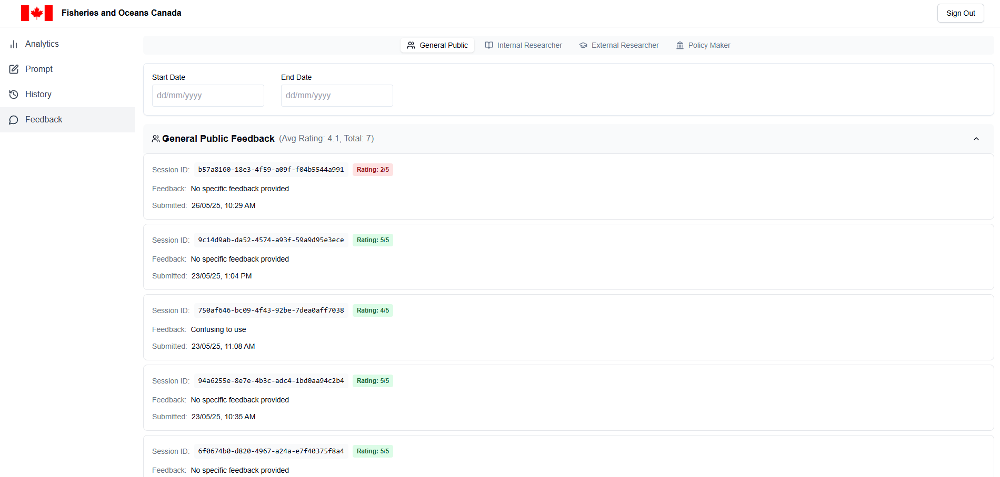
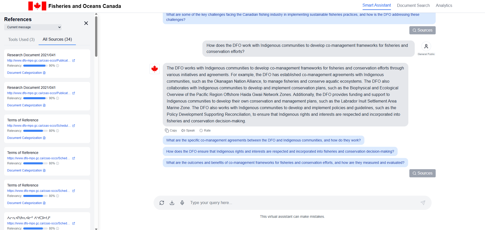

# User Guide

**Please ensure the application is deployed, instructions in the deployment guide here:**

- [Deployment Guide](./deploymentGuide.md)

Once you have deployed the solution, the following user guide will help you navigate the functions available.

| Index                             | Description                              |
| --------------------------------- | ---------------------------------------- |
| [Administrator View](#admin-view) | How administrators view the project      |
| [Public View](#public-view)       | How the general public views the project |

## Administrator View

### Signup

Within the admin page, users can sign up by pressing the sign up button and filling in their information. Once signed up, they will require approval, given through the AWS console, before their account recieves administrator access (and therefore will not be able to log in until this is done).

During sign-up, users will need to enter a confirmation code sent to their email.

After inputting the confirmation code sent to their email and being given administrator privileges, administrators can log in.

Grant administrator privilege to users by changing their user group with Cognito through the AWS Console:

After clicking the user pool of the project, find the emails of the administrators to be approved:

After clicking their email, add the 'admin' user group:

### Analytics Dashboard

Upon logging in, the administrator will see the analytics of the public view of DFO Smart Search. This includes the number of smart assistant sessions per given time period, the number of messages sent by each role, and the average feedback score for each role.

### AI Prompt Editing

Clicking on the "Prompts" button on the side bar will allow administrators to edit the system prompts given to the AI smart assistant separately for each role. Doing this will change the assistant's behaviour to suit the instructions provided in the prompt for all users of that particular role upon pressing the save button.

### Viewing User Chat Histories

Within the "History" tab on the sidebar, administrators can view the different AI smart assistant sessions that users have created in the public view of the app, for each separate role denoted by the role selector tabs at the top.

At the top of this page, administrators can also filter for sessions within a certain timeframe. They can also click the "Download All Messages" button to download all chat histories as a `.csv` file.

Clicking on a session from the history page will open the conversation history for that session.

The administrator can view the user role, session id, user messages, AI responses, as well as the AI's provided recommended followup questions.

### Viewing User Feedback

Navigating to the "Feedback" tab on the sidebar will allow the administrator to view all the feedbacks in every user role, as well as their descriptions.

Each feedback entry can also be clicked on for further details, similar to the chat history functionality shown above.

## Public View

### Landing Page

Upon opening the public view of the app, users are greeted with a home page. Clicking on "About" or "T&C" will open a modal which either describes the DFO project or shows the terms and conditions of using the assistant.

### AI Assistant

After clicking Get Started, the assistant will initiate the conversation by prompting the user to select their role. Users must click one of the 4 options to select their role before they can begin interacting with the AI assistant.

Users can then type their question to the assistant, or click on a recommended question to ask to the assistant. Pressing the send icon or the enter key will send the users question to the assistant. Pressing the refresh button will create a new session and restart the conversation with the assistant.

Once the user sends a message and recieves a response from the assistant, they are also able to click on the "Sources" button in the lower right corner of the screen, which will reveal some of the sources (including documents) the assistant retrieved information from to answer the user's question.

Clicking the "Rate" button under any AI message will open a feedback prompt, in which users can rate the assistant from 1 to 5 stars and provide additional details. Clicking "Send Feedback" will complete the feedback process.

### Document Search

### Analytics
